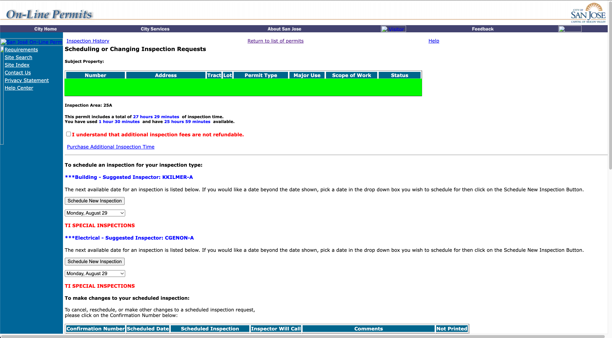
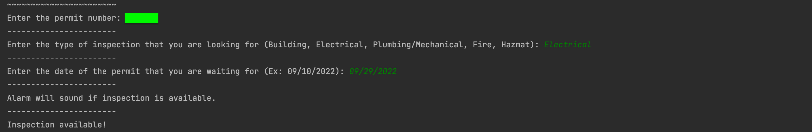
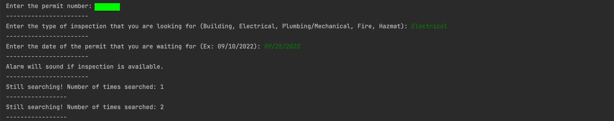

# Reload-Notify-Program

## Purpose
This project was created to automatically monitor the San Jose building department website to check for available inspection appointments. 

**Use of this program helped decrease the total schedule duration by 3-4 weeks for a $55M commercial construction project.** A missing electrical inspection was blocking work from continuing on the project, causing serious cost and schedule problems. This program automatically notified the team when sooner inspections were available due to cancellations. 

## How it works
Technologies used: Selenium, Beautiful Soup, and Pygame libraries. 

**Selenium** is an open source tool that is used to automate browsers. For this project, Selenium was used to launch a chrome browser and automate the sign in process for the San Jose building department website. This helps set user login credentials and enables continuous searching without user intervention.

**Beautiful Soup** is a python library that is used to pull data out of HTML and XML files. For this project, Beautiful Soup was used to extract the HTML content of the inspection page and enables the program to search for a specific date and discipline of inspection based on user input. 

**Pygame** is a python module that is designed for writing video games. For this project, Pygame was used simply to play a .mov file. This alerts the user when the inspection is available.


## How to Install and Run
This program is designed to run on mac os with the chrome browser

1. Download chrome driver and store in correct folder -> [tutorial](https://www.youtube.com/watch?v=pyqz8X7UUDs).
2. Install Selenium, BeautifulSoup, and Pygame through IDE or console.

```bash
>>> pip install selenium
```

```bash
>>> pip install beautifulsoup4
```

```bash
>>> pip install pygame
```

3. Run program and complete user inputs.
4. Wait for program to alert that an inspection is available. 

## Visuals (Specifics covered for privacy)

Inspection website:



Ouput when designated inspection is available:



Output during search (automatically reloads page every 2 seconds):




## Potential Improvements

1. Validate correct user inputs before launching seach. 
2. Notify user via email or text when inspection is available instead of alarm

Note: The most important factor when writing this program was time. It was crucial that the program was operating as quickly as possible so that the inspections could be booked. 
